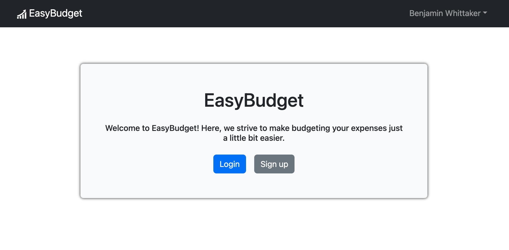
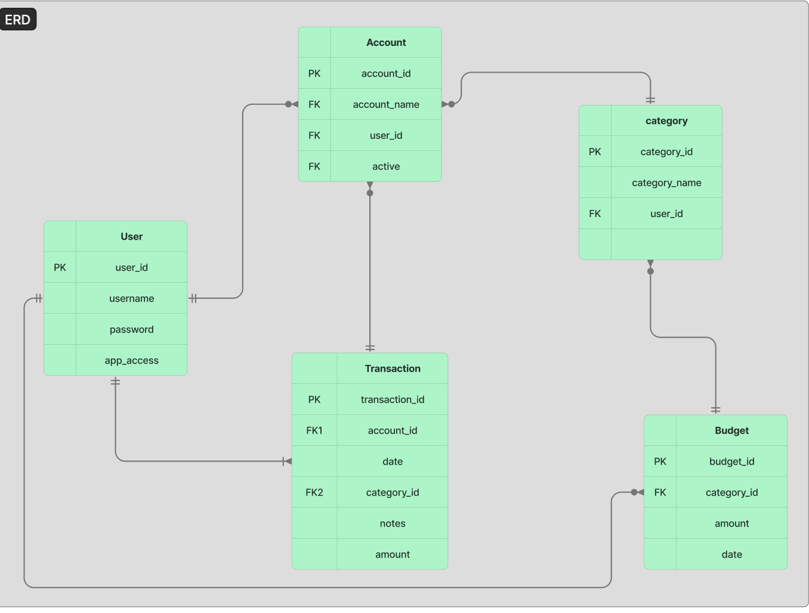
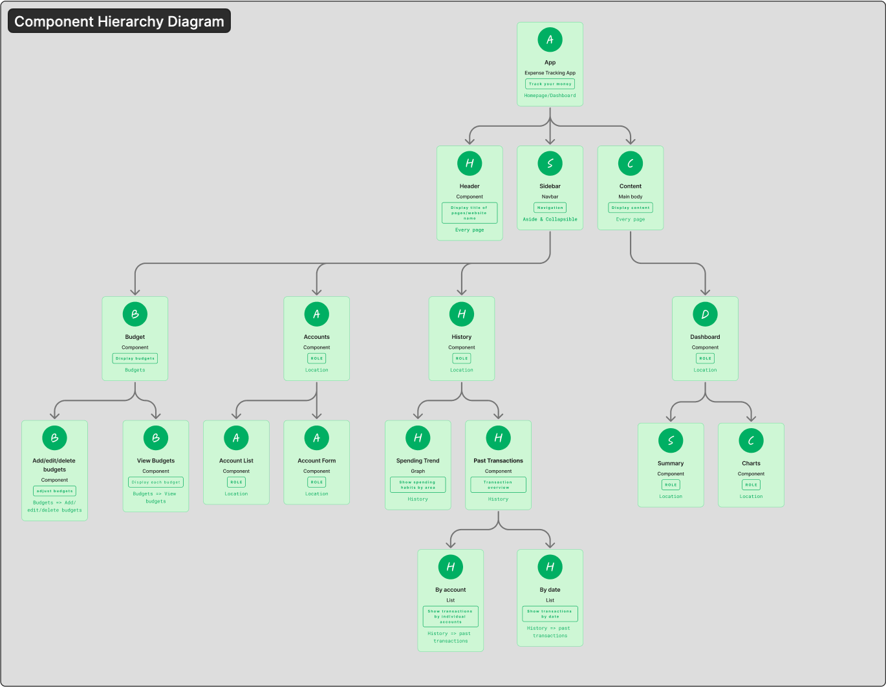
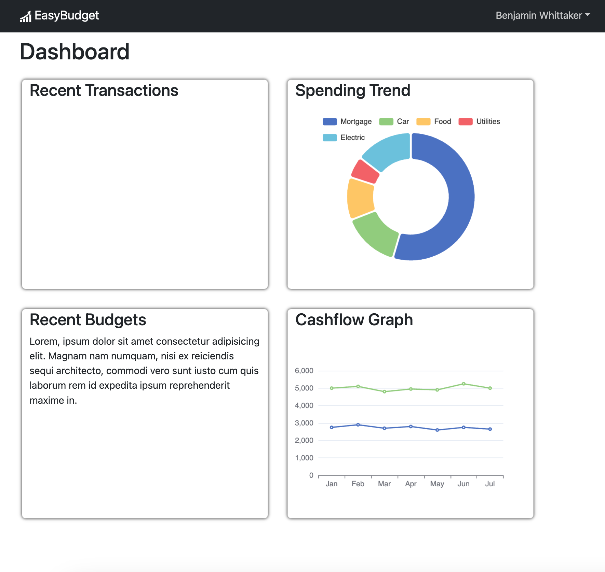
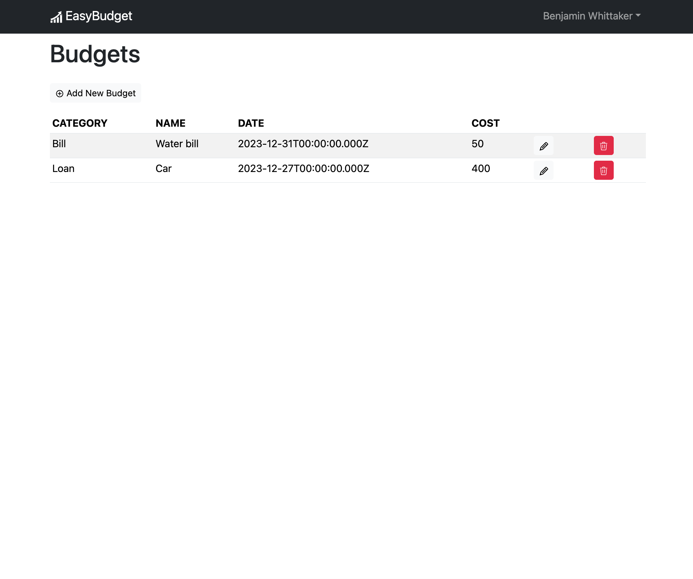

# EasyBudget

##Description

EasyBudget is an easy to use budget app where you can bring your bills, transactions and accounts to one spot in order to simplify your life. View your created budgets/savings goals, see spending habits, or look up specific transactions. We aim to make lives just a little bit easier in these crazy times.

## Technologies Used

- **MongoDB**
- **Express.js**
- **React**
- **Node.js**
- **Redux Toolkit**
- **React Bootstrap**

## Key Features

- **User Authentication:** Secure user authentication using JWT (JSON Web Tokens).
- **Expense and Income Tracking:** Users can add, edit, and delete transactions with details such as amount, category, and date. (future goals)
- **Visualization:** Interactive charts and graphs to visualize spending patterns over time. (future goal)
- **Responsive Design:** Built with React Bootstrap for a mobile-friendly and responsive user interface.
- **Redux Toolkit:** State management using Redux Toolkit for efficient and predictable state management.

## App Images

## License

- **MIT**
